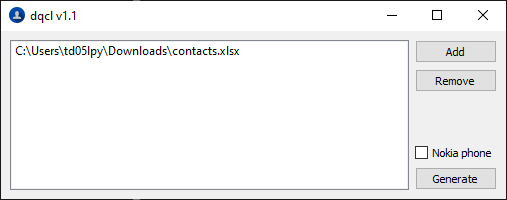

# dqcl

Simple company VCF contact generator from contact list stored in Excel files.

- Python 3
- [Pandas](https://pandas.pydata.org)
- [OpenPyXL](https://openpyxl.readthedocs.io)
- Qt framework via [PyQt5](https://pypi.org/project/PyQt5/)

## GUI

dqcl has GUI based on Qt framework. It supports all Windows versions since WinXP and scales to custom DPI.



Simply use Add button to select Excel files with contacts you've exported from Infoportal. Optionally the app can generate contacts in old format for Nokia dumb phones.

## CLI

dqcl also offers command line interface. Unfortunately no stdout output is provided for GUI executable due win32 limitations.


```
usage: dqcl.py [-h] [-d] [-o OUTPUT] [input [input ...]]

positional arguments:
  input                 list of XLS files with contacts

optional arguments:
  -h, --help            show this help message and exit
  -d, --debug           enables debug logging
  -o OUTPUT, --output OUTPUT
                        output filepath of VCF file

```

## Requirements

- Python 3+
- PyQt 5+
- PyInstaller 3.2+ (for build)
- Pandas
- OpenPyXL

## Build

```
pyinstaller dqcl.spec
```

The binary will be build into `./dist` folder.

## Requirements


## Download

For download, please refer to releases section. Available binary were build under Windows 10 targeting MSVCR14.
